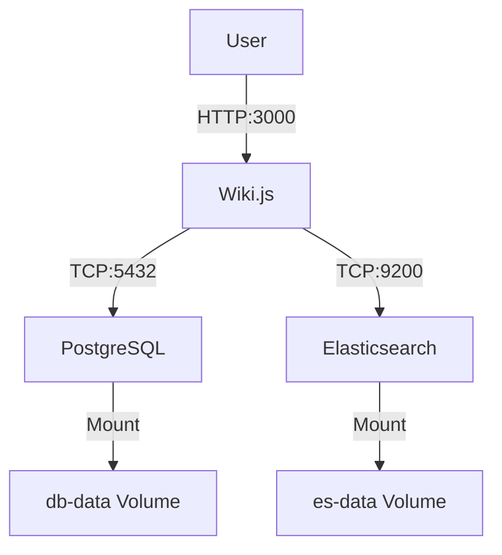

# alejandria-dev
Proyecto para pruebas internas de WikiJs

## Architecture

```mermaid
graph TD
    User[User] -->|HTTP:3000| Wiki[Wiki.js]
    Wiki -->|TCP:5432| DB[PostgreSQL]
    Wiki -->|TCP:9200| ES[Elasticsearch]
    DB -->|Mount| VolDB[db-data Volume]
    ES -->|Mount| VolES[es-data Volume]
```
