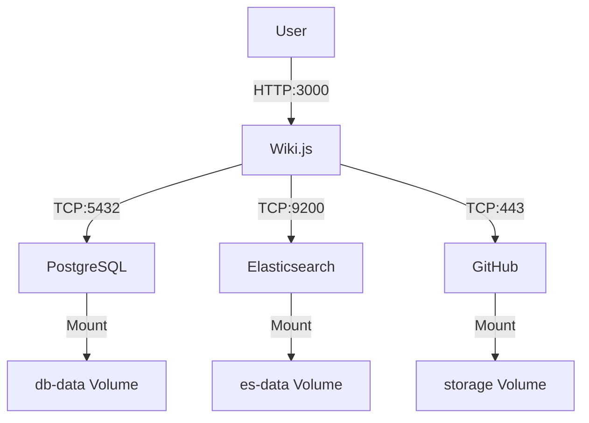

# 📚 Alejandria Knowledge Platform 

Alejandría es el repositorio de información de conocimiento de Pragma, donde se registran y disponibilizan los documentos, notas, procedimientos, etc. que son relevantes para la empresa. El principal contenido se clasifica en estos tipos:

- 🧠 **Conocimiento Aplicado**
- 💬 **Ejes de Conversación**
- 🏆 **Frameworks de Calidad**
- 📂 **Información general de Proyectos Internos Pragma**

## 📋 Table of Contents

- [Business Context](#-business-context)
- [Requirements](#-requirements)
- [Non-Functional Requirements](#-non-functional-requirements)
- [Architecture](#-architecture)
- [Setup Instructions](#-setup-instructions)

## 🏢 Business Context

Los diferentes equipos (Chapters) de Pragma pueden registrar, actualizar y compartir información en forma de Texto (Markdown) o enlaces a documentos y recursos internos y externos que son relevantes de acuerdo a las categorías definidas anteriormente.

## ✅ Requirements

- Se requiere poder crear paginas y directorios para organizar el contenido.
- Se requiere poder registrar y actualizar información en forma de Texto (Markdown) o enlaces a documentos y recursos internos y externos que son relevantes de acuerdo a las categorías definidas anteriormente.
- Se requiere poder buscar información de manera eficiente.
- Se requiere poder compartir la información de manera segura y con control de acceso.

## 🚀 Non-Functional Requirements

- Se requiere que la plataforma sea escalable para soportar un crecimiento en el número de usuarios y contenido.
- Se requiere que la plataforma sea segura y con control de acceso.
- Se requiere que la plataforma sea accesible desde cualquier computadora con conexión a internet.
- Se requiere que la plataforma sea fácil de usar y con una buena experiencia de usuario.

## 🏗️ Architecture

## ⚙️ Setup Instructions

For detailed setup and development instructions, please refer to [Development Instructions](environments/docs/development-instructions.md).
