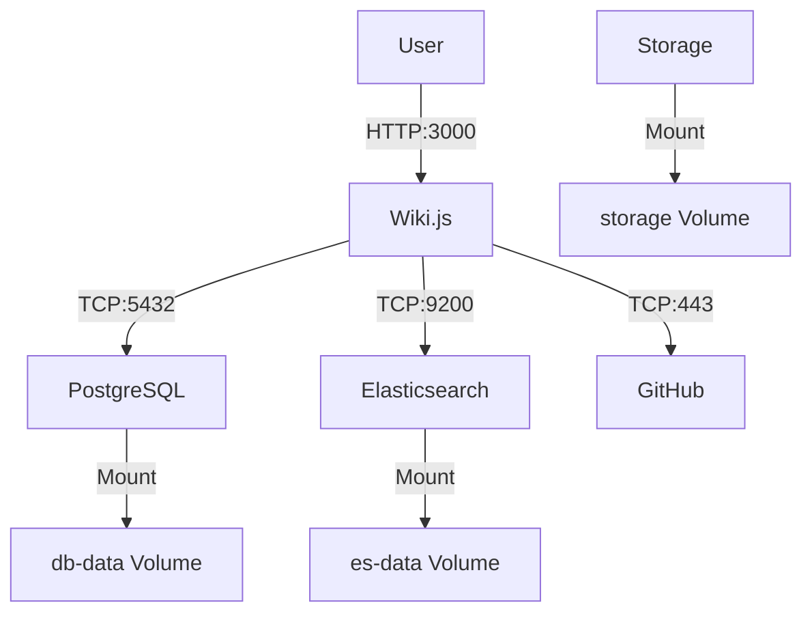

# alejandria-dev
Proyecto para pruebas internas de WikiJs

## Business Context

TO DO Business Context

## Requirements

TO DO Requirements

## Non-Functional Requirements

TO DO Non-Functional Requirements

## Architecture

